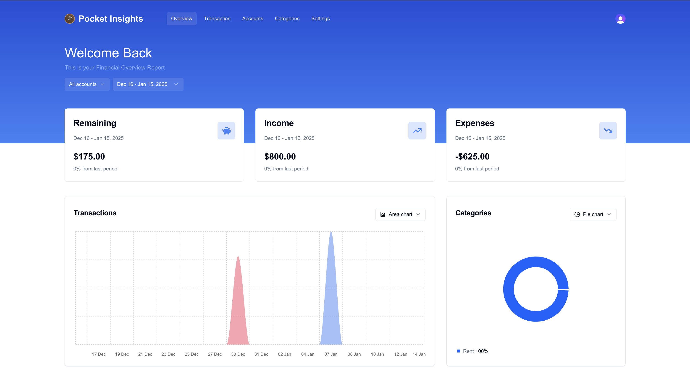

# Pocket Insights

### Track all your accounts and transactions in one place and unlock powerful insights into your spending habits.

### Try it yourself: https://finance-tracker-xi-nine.vercel.app/

<div align="center">
  
</div>

</div>

## Built With

- `Next.js`
- `React.js`
- `TypeScript`
- `React Icons`
- `Neon`
- `drizzle`

## Features:

- **Effortless Google Sign-In:**  Log in instantly with your Google account and get started in seconds.
- **Full Control Over Accounts:** Seamlessly create, edit, and manage your accounts, categories, and   transactions.
- **Bank Transactions Made Simple:** Easily import your bank transactions via CSV and keep your records up to date.
- **Powerful Insights at Your Fingertips:** Gain detailed insights into your income and expenses, categorized for clarity.
- **Customizable Filtering:** Analyze your financial data for specific categories or time intervals with flexible filters.

## Csv File Format For Upload:
- This is a sample file for importing transactions. The key requirement is that the dates must strictly adhere to the format specified in the sample file below; all other details can vary.
```
Type,Account,Started Date,Completed Date,Description,Amount,Currency,State,Balance
CARD_PAYMENT,Current,2024-01-08 20:18:58,2024-01-09 11:58:22,Shop,-13.27,USD,COMPLETED,19.79
CARD_PAYMENT,Current,2024-01-09 20:02:00,2024-01-10 02:50:21,Texts,-4.59,USD,COMPLETED,15.20
```
## Installation and Usage

### Clone this repository

`git clone https://github.com/kandgesid/finance-tracker.git` <br/> <br/>
`cd finance-tracker`

### Install Dependencies

`npm install`

In the project directory, you can run:

### npm run start

Runs the app in the development mode.\
Open [http://localhost:3000](http://localhost:3000) to view it in the browser.

The page will reload if you make edits.\
You will also see any lint errors in the console.

### npm run build

Builds the app for production to the `build` folder.\
